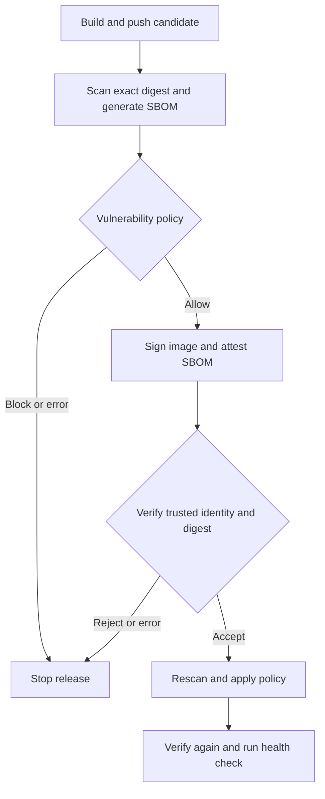

# Trusted Container Pipeline

[](https://github.com/ALVINNNNN/trusted-container-pipeline/actions/workflows/pipeline.yml)

**Can I prove where a container came from before I run it?**

A hands-on DevSecOps project that builds a small Python API, scans its image,
generates an SBOM, signs the approved image with GitHub Actions identity, and
verifies it before deployment to a disposable runner.

The interesting part is testing the failures: an unsigned image, the wrong
signing identity, a modified image, and a vulnerability policy violation.

## Pipeline



The candidate is pushed to GHCR so it can be signed and verified by digest.
**Registry presence does not mean release approval.** Only the gated path runs it.

## What it demonstrates

| Scenario | Test and expected result |
|---|---|
| Trusted image | Real Cosign signature and signed CycloneDX attestation verified; API health check passes |
| Unsigned image | Candidate is checked before signing and rejected |
| Wrong identity | Signed image checked against an untrusted workflow identity and rejected |
| Modified image | A benign extra file changes the image digest; the new unsigned image is rejected |
| Critical vulnerability | Explicitly synthetic scan fixture is blocked, including when no fixed version exists |
| Invalid evidence | Unit tests reject missing results, wrong image, malformed report and mutable tags |

Negative signature tests also check the error message. An unrelated network or
registry error must not count as proof that a security control worked.

## Run it

1. Open **Actions → Trusted Container Pipeline → Run workflow → main**.
2. Watch **Policy tests**, then **Sign, verify and demonstrate**.
3. Open the run summary and download `security-evidence-<run>-<attempt>`.

A push to `main` also runs the complete pipeline. Pull requests run only local
tests with read-only repository permissions; they cannot publish or sign images.

No manually created PAT, cloud account, or signing secret is required. The release
job uses the temporary `GITHUB_TOKEN` for GHCR and GitHub OIDC for keyless signing.
GitHub Actions and package usage remain subject to the account's quotas.

If GHCR denies the push, check that organization/repository policies permit
package publishing and that this repository has write access to an existing
package with the same name. Do not add a broad PAT to work around it.

## Evidence to inspect

| Artifact file | What it tells you |
|---|---|
| `image.txt`, `source-commit.txt` | Exact released digest and source commit |
| `scan.json`, `pre-deploy-scan.json` | Actual Trivy results for that digest |
| `build-decision.json`, `deploy-decision.json` | Policy verdict, severity counts and blocking findings |
| `sbom.cdx.json` | CycloneDX software inventory |
| `signature-verification.json` | Cosign verification of the approved digest and workflow identity |
| `attestation-verification.json` | Verified signed SBOM statement |
| `unsigned.log`, `wrong-identity.log`, `modified-image.log` | Actual rejection output |
| `synthetic-policy.log` | Clearly labeled synthetic Critical-policy demonstration |
| `health.json`, `scenarios.txt` | Health response and checks that actually completed |

Artifacts are retained for 14 days. Download evidence before it expires.
No static README claim substitutes for a successful workflow run.

## Policy

`policy/release.json` blocks **all CRITICAL findings**, with or without a fix.
HIGH, MEDIUM, LOW and UNKNOWN findings remain visible but do not block this
learning baseline. This is not a claim that an allowed image is vulnerability-free.

For a stricter policy, change `block_severities` to `["HIGH", "CRITICAL"]` and run
again. If a real scan blocks a release, inspect the CVE, package and fixed version
in the decision file; update the affected dependency/base image and rebuild.
Do not change the threshold simply to make the badge green.

## Try locally

With Python 3.10+:

```bash
python3 -m unittest discover -s tests -v
python3 scripts/policy-demo.py
python3 app/server.py
# In another terminal:
curl http://127.0.0.1:8080/health
```

With Docker:

```bash
docker build -t trusted-container-demo .
docker run --rm --read-only --cap-drop ALL --security-opt no-new-privileges \
  -p 127.0.0.1:8080:8080 trusted-container-demo
```

The local Docker command is an application smoke test; it does not provide the
GitHub keyless signing flow. Use Actions for the complete security demonstration.

## Security choices and limits

- Sign and deploy by immutable SHA-256 digest, not a mutable tag.
- Match the exact workflow URL and `refs/heads/main` certificate identity, plus
  the GitHub Actions OIDC issuer. Keep transparency-log checks enabled.
- Pin third-party Actions by commit and tool downloads by SHA-256. Tool hashes
  are a reviewed upstream-release trust bootstrap, not independent provenance.
- Verify the signed SBOM, then scan the exact image again before deployment.
- Run as a non-root user with a read-only filesystem and dropped capabilities.
- The Python standard-library HTTP server is a demo, not a production server.
- The base image tag is intentionally refreshed by `--pull`; the resulting image
  is pinned at release time. For reproducible builds, pin the base-image digest
  and maintain an explicit update process.
- Repository writers can change the workflow and policy. Main-branch protection,
  required review, protected environments, and an independently managed admission
  policy are needed for stronger separation of duties; this project does not
  configure those account controls.
- A valid signature establishes the signer and content integrity, not safe code.
  A signed SBOM is an inventory statement, not a full SLSA provenance attestation.
- The modified-image demo creates a different unsigned digest; it does not forge
  or mutate a valid signature. Wrong-identity testing uses the genuine signature
  against a deliberately incorrect allowlisted identity.
- GitHub, GHCR, Sigstore services, runner integrity, scanner databases and the
  tool publishers remain part of the trust boundary.

## Learn and extend

See [the learning guide](docs/LEARNING.md) for exercises, expected observations,
troubleshooting, and a short demo outline.

Next steps: pin the base digest, add signed build provenance, move verification
into a separate deployment workflow, then enforce the same policy through a
Kubernetes admission controller.

## References

- [Sigstore keyless signing](https://docs.sigstore.dev/quickstart/quickstart-cosign/)
- [Cosign verification](https://docs.sigstore.dev/cosign/verifying/verify/)
- [Trivy documentation](https://trivy.dev/docs/)
- [GitHub artifact attestations](https://docs.github.com/en/actions/concepts/security/artifact-attestations)
