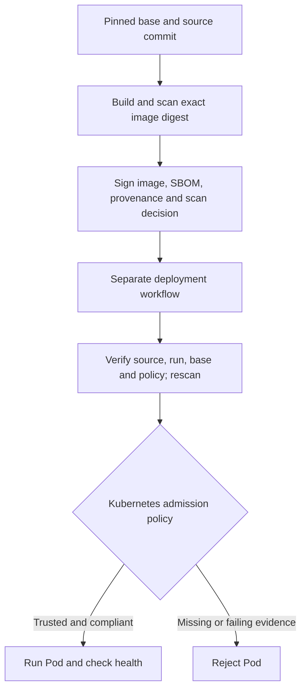

# Trusted Container Pipeline

[](https://github.com/ALVINNNNN/trusted-container-pipeline/actions/workflows/pipeline.yml)
[](https://github.com/ALVINNNNN/trusted-container-pipeline/actions/workflows/deploy.yml)

**Prove what was built, who signed it, and whether Kubernetes should allow it to run.**

A hands-on DevSecOps project with two independent workflows. Build signs an image
and its evidence. Deployment verifies that evidence, rescans the image, and asks
Kubernetes to admit it under an enforcing Kyverno policy.

## Architecture



## Implemented controls

| Control | Implementation |
|---|---|
| Pinned base | Docker Hub Python base uses a verified immutable multi-platform index digest |
| Signed provenance | SLSA v1-format predicate records source commit, base digest, platform, builder and run ID/attempt |
| Separate deployment | `deploy.yml` has package-read and Actions-read permissions; no package-write or OIDC signing permission |
| Safe handoff | Download only JSON metadata from a successful same-repository main build; validate it against authenticated GitHub run metadata |
| Independent checks | Verify signatures and signed predicates, require a scan <= 24 hours old, then rescan the exact digest |
| Admission enforcement | Kyverno checks signatures, signed SBOM, provenance and scan policy before the Pod is admitted |
| Shared policy | Both CI and admission derive blocked severity counts from `policy/release.json` |
| Runtime restrictions | Non-root Pod, no service-account token, read-only filesystem, dropped capabilities and resource limits |

No manually created PAT, signing secret, cloud account or persistent cluster is
required. GHCR credentials are temporary job tokens. GitHub usage is subject to
the account's Actions/package quotas.

## Real rejection demos

| Case | Expected result |
|---|---|
| Approved image and complete compliant evidence | Pod admitted, Ready and `/health` returns `{"status":"ok"}` |
| Unsigned/modified image | Rejected by the signature rule |
| Signed image with SBOM and scan but no provenance | Rejected by the provenance rule |
| Signed image with a failing scan fixture | Rejected by the scan rule |
| Signed image referenced by a mutable tag | Rejected because the digest is required |
| Approved application with an unsigned init container | Rejected by signature verification |
| Wrong expected workflow identity | Rejected by the deployment's Cosign verification test |

The failing scan fixture is explicitly **synthetic**, not a real CVE finding.
Its image, signature and admission request are real. Negative admission tests use
server-side dry runs, so rejected images never execute. A generic infrastructure
failure is not counted as a successful rejection test.

## Run and inspect

1. Open **Actions → Trusted Container Pipeline → Run workflow → main** (or push to main).
2. After the build succeeds, **Deploy Verified Release** starts automatically.
3. Open both run summaries and download their evidence artifacts.
4. For deployment-only retries, run **Deploy Verified Release** manually with the
   successful build run ID. Old builds are rejected if their evidence is stale or
   no longer matches the reviewed base/policy.

Pull requests run unit tests only and cannot publish or sign images. The deployment
workflow never checks out a PR head or executes files from downloaded artifacts.

## Evidence

| Build evidence | Deployment evidence |
|---|---|
| Actual Trivy scan and policy decision | Verified signature and decoded-validation results |
| CycloneDX SBOM | Verified signed SBOM, provenance and scan envelopes |
| Signed provenance/scan predicates | Authenticated upstream run metadata |
| Approved and fixture image digests | Fresh Trivy scan and deployment decision |
| Build log and source commit | Rendered/applied Kyverno policy and rejection logs |
| JSON release handoff | Pod readiness and Kubernetes API health response |

Artifacts are retained for 14 days. A green build badge alone does not prove
admission succeeded: check the separate deployment badge and its actual logs.

## Vulnerability policy

The baseline blocks **all CRITICAL findings**, including those without a fix.
HIGH, MEDIUM, LOW and UNKNOWN remain visible but do not block. This is a learning
policy, not a claim that an allowed image is vulnerability-free.

Change `block_severities` to `["HIGH", "CRITICAL"]` for a stricter policy. Admission
is generated from the same file, so it tightens with CI. Remediate blocked findings
by updating the affected package/base image and rebuilding; do not lower the
threshold simply to make the badge green.

## Local learning

```bash
python3 -m unittest discover -s tests -v
python3 scripts/policy-demo.py
python3 app/server.py
# In another terminal:
curl http://127.0.0.1:8080/health
```

The API uses Python's standard-library HTTP server for demonstration, not production.
Use GitHub Actions for keyless signing and the complete Kubernetes exercise.

- [Learning exercises](docs/LEARNING.md)
- [Build provenance definition](docs/BUILD-TYPE.md)
- [Kubernetes policy, scope and limits](kubernetes/README.md)

## Trust boundaries

The base pin prevents silent tag changes; it does not make the entire build
hermetic or bit-reproducible. Dependabot can propose Docker base updates. Review
new pins and tool release checksums before accepting them.

Provenance is generated inside the build workflow and signed by that workflow.
It is not independent proof of SLSA Level 3. A compromised authorized builder can
still sign bad software. The deployment workflow is separate, but both workflows
and the policy remain in the same repository; protect main and use independent
policy ownership for stronger separation of duties.

The kind cluster and Kyverno policy are temporary. Policy applies to Pods in
`trusted-demo`, not every namespace. The demo job is a cluster administrator;
production deployers must not be allowed to change admission controls. A long-lived
cluster also needs scan-freshness and verification-cache policies. Running Pods
are not continuously rescanned by this project.

Actions are commit-pinned, downloaded tools/install manifests are checksum-pinned,
and the kind node image is digest-pinned. The upstream Kyverno installer contains
versioned controller image tags. GitHub, registries, runner images, trusted tool
publishers and Sigstore services remain dependencies.

## References

- [Cosign verification](https://docs.sigstore.dev/cosign/verifying/verify/)
- [SLSA provenance](https://slsa.dev/spec/v1.2/provenance)
- [Kyverno signatures and attestations](https://kyverno.io/docs/policy-types/cluster-policy/verify-images/sigstore/)
- [Trivy documentation](https://trivy.dev/docs/)
